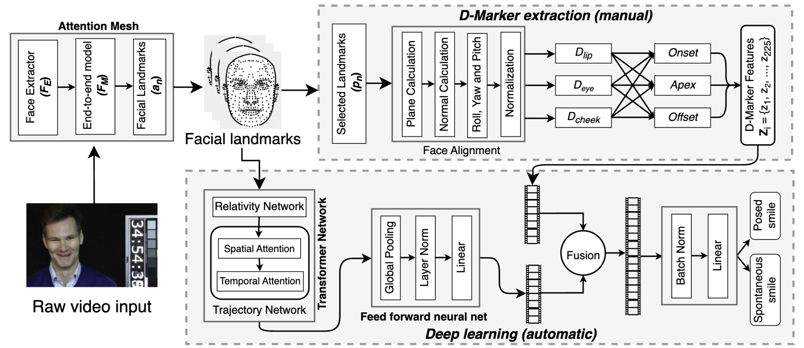
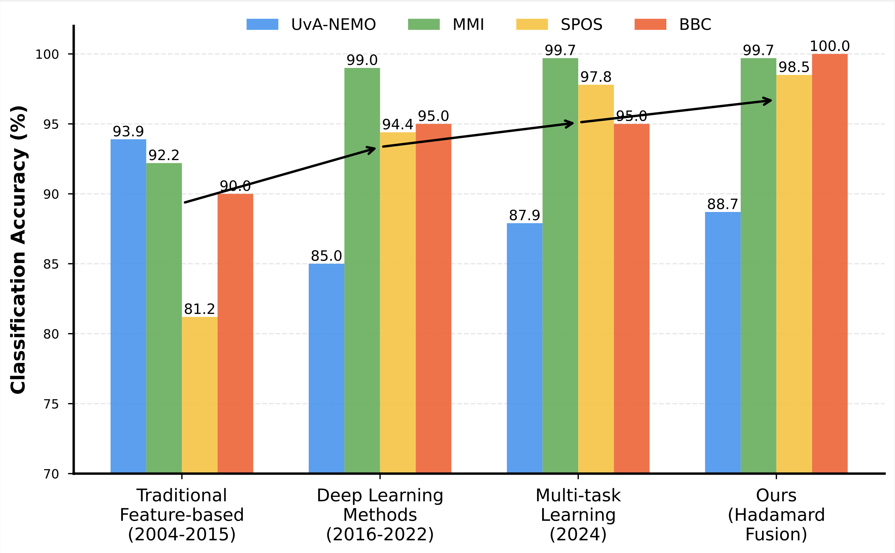

# D-FuseSmileNet



## Table of Contents
1. [Background](#background)
2. [Repository Structure](#repository-structure)
3. [Dependencies](#dependencies)
4. [Getting Started](#getting-started)
5. [Reproducing Results](#reproducing-results)
6. [License](#license)

---

## Background

Spontaneous smile recognition has evolved significantly over the years, from traditional feature-based methods to advanced deep learning techniques. While multi-task learning frameworks like **DeepMarkerNet** improved upon earlier approaches by combining handcrafted D-Marker features with deep networks, they come with some limitations, such as, they are prone to inefficiency as they require careful calibration and tuning of weights during combination. To address this, **D-FuseSmileNet** introduces a comprehensive fusion of handcrafted D-Marker features with automatic features extracted using transformer-based architectures, such as MeshSmileNet. This framework achieves state-of-the-art results across benchmark datasets, offering a powerful solution for spontaneous smile classification.


---

## Repository Structure

The repository is organized as follows:
```
.
├── Code/
│   ├── BBC/
│   │   ├── [15 notebooks implementing the fusion methods]
│   │   ├── dataset/   # Models will be saved here
│   │   ├── core/      # Supporting Python scripts and utilities
│   │   ├── labels/    # Cross-validation data for k folds
│   │   ├── npy/       # Links to required numpy files for the dataset
│   ├── SPOS/ [same structure as above]
│   ├── UvA-NEMO/ [same structure as above]
│   ├── MMI/ [same structure as above]
├── LICENSE
├── README.md
├── requirements.txt
```

---

## Dependencies

This project is built with the following dependencies:
- Python 3.8
- `numpy==1.21.5`
- `Pillow==9.0.1`
- `dlib==19.24.0`
- `opencv-python==4.6.0.66`
- `torch==1.11.0`
- `torchvision==0.12.0`
- `vidaug==1.5`
- `einops==0.6.0`
- `tqdm==4.64.1`
- `colorama==0.4.6`

To install the dependencies, run:
```bash
pip install -r requirements.txt
```

---

## Getting Started

Follow these steps to set up the project and reproduce results:

### 1. Clone the Repository
```bash
git clone https://github.com/junayed-hasan/smile-recognition-fusion.git
cd smile-recognition-fusion
```

### 2. Prepare the Dataset
Each dataset folder (e.g., `BBC`, `SPOS`, `UvA-NEMO`, `MMI`) contains:
- A `npy/` folder with links to download the required numpy files. Download the datasets and place them in the corresponding `npy/` folders.

### 3. Set Up Environment
Install the required dependencies:
```bash
pip install -r requirements.txt
```

### 4. Run Experiments
Each dataset folder contains 15 Jupyter notebooks for the different fusion techniques. You can run these notebooks to reproduce the results for individual methods.

For example:
- Navigate to the `Code/BBC` folder.
- Open `concatenation.ipynb` to execute the simple concatenation fusion experiment.

---

## Reproducing Results

1. **Run Cross-Validation:**
   - By default, the experiments will run on 10-fold, 10-fold, 9-fold and 7-fold for each of UvA-NEMO, BBC, MMI and SPOS respectively. 

2. **Save and Load Models:**
   - Models are saved to the `[dataset name]/` folder within each dataset directory. Ensure the `[dataset name]/` folder is writable for saving checkpoints. For example, inside BBC, there is another folder named bbc where the models will be saved.

3. **Evaluate Fusion Techniques:**
   - Execute each notebook in the dataset folders (`BBC`, `SPOS`, `UvA-NEMO`, `MMI`) to evaluate all 15 fusion techniques.

4. **Performance Comparison:**
   - Use the provided architecture and techniques to compare with the baseline methods and state-of-the-art benchmarks. Results will be outputted in the console or saved in corresponding directories.

---

## License

This project is licensed under the MIT License. See the [LICENSE](LICENSE) file for details.

---

**© 2024 Mohammad Junayed Hasan**
```

Make sure to replace placeholders like `https://github.com/yourusername/D-FuseSmileNet` with the actual repository link before publishing.
